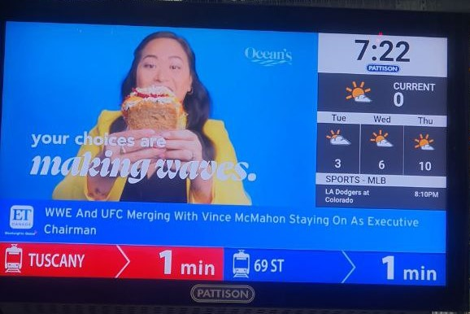

# Subway Screen Project

## Project Description

The mayor of the city X has decided to update the screens on their subway trains as it is something like this.

 After seeing the screens in the stations of the city Calgary, he wants a similar system to be implemented
 . Your task is to create a Java17 desktop application that displays information on the screens inside the trains. Something similar to the following figure but with some improvements:

 

 The city X has three subway lines (Red, Green, and Blue) with approximately 120 stations. A list of the stations has been provided by the city hall in the form of a CSV file (i.e., [Map](https://github.com/mjza/ENSF380-SUMMER2023/tree/main/Project/Map/Map.csv)). 

A controlling system reports the position and direction of the 12 trains every 15 seconds. Each line has four trains that travel continuously on their respective line. To access the data of the controlling system, a simulator is provided in the form of a jar file. The simulator places a file in the form of `Train_<Timestamp>.CSV` in any output folder specified via command line. To run the simulator and see the generated outputs, please follow the instructions provided in the simulator's [readme file](https://github.com/mjza/ENSF380-SUMMER2023/tree/main/Project/Simulator/Readme.md).

Three sample Java applications have been developed to run the jar file. You can fork the repository provided at [https://github.com/mjza/SubwayScreen](https://github.com/mjza/SubwayScreen) and continue your development on your forked repo. **Make your repository hidden**. Please note that the amount of your contribution is measured by the amount of commits/contributes that you make in your repository. You may receive different mark than your group mates if you haven't had enough contribution. 

Your application must have the following functionalities:

1. The main screen is devided to four sections.
2. The largest section will display advertisements. Please create a database and design tables to moderate text and media of the advertisements that the city hall absorbs and displays on the screen. The media files can be of types PDF, MPG, JPEG, BMP. The advertisements must be changed continuously. Each ad must be shown for 10 seconds. Every 10 seconds, display the big map for 5 seconds in the advertisement frame. The map must show the position of the trains including the current train. I made several pictures in the [Map folder](https://github.com/mjza/ENSF380-SUMMER2023/tree/main/Project/Map).

1. A section for time and weather report must be included in the right or left corner. Please use the website [https://openweathermap.org/](https://openweathermap.org/) to download the simple HTML page and parse the it using regular expressions to extract the data. This task must be done in a separated jar file and you use it in your code as external library. You need to develope a separated Java project for it. Represent the weather report in any way you like, but please note that only the daily report is required, not the forecast for the next days. The website provides weather for different cities using a code. For example, for Calgary use [https://openweathermap.org/city/5913490](https://openweathermap.org/city/5913490). I will give you a city code on the day of presentation. The code must be passed as a command line parameter and your application must show the weather report of that city. 

2. A section for news must be included. Use a free open API like [https://newscatcherapi.com/](https://newscatcherapi.com/free-news-api) to access news data. The news must scroll on the screen in a way that we could read it. Please provide another command line argument to be able to filter news based on some keywords. For eexample, news related to city X! For accessing news you must use APIs (e.g., RESTful API) which are provided by news agancies. 

3. Finally, a section must be included that shows the one past and four future train stations and displays the direction of the train. Something like this:

4. You application must annonce the next station and when passengers can change the lines. It must hint them possible line(s). You can record your own voice or use some text to speech services or library. For example, "Next stop: Mill Creek Station, you can change your train to line blue", "Next stop:  Hilltop Station". We have provided the list of stations in a [CSV file](https://github.com/mjza/ENSF380-SUMMER2023/blob/main/Project/Map/Map.csv). Please note the column H, provided the common stations between lines by their code.   

Note that the layout of the screens does not need to be exactly like the provided figures, but it should have similar functionalities.

A UML class diagram is required to demonstrate the following components in your code:

1. Inheritance
2. Abstract classes/Interfaces
3. Polymorphism
4. Usage of Static/Final/Final Static
5. Composition, Aggregation, and Association relationships
6. Usage of the `<<uses>>` and `<<throws>>` relationships for error handling
7. Definition of Cardinalities.  

**Please note you must demonstarte that you have the ability to use OOP paradigm in solving problems.**

Good luck with your project!

